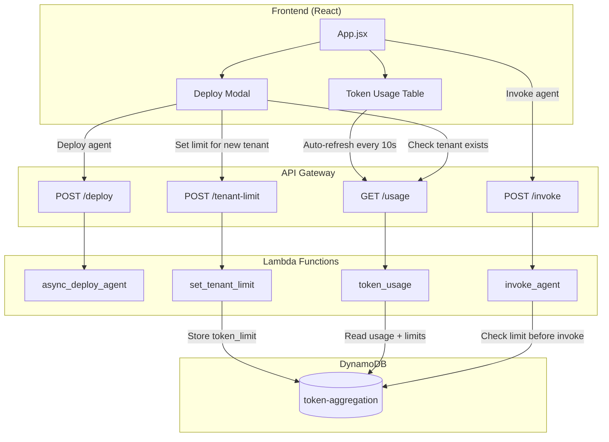

# Design Document: Tenant Token Limits

## Overview

This design extends the existing Bedrock Agent Dashboard to support per-tenant token limits. The solution leverages the existing DynamoDB aggregation table to store token limits alongside usage data, modifies the invoke agent Lambda to enforce limits, and updates the React frontend to display usage percentages and auto-refresh data.

The architecture follows the existing patterns in the codebase, minimizing changes while adding the new functionality.

## Architecture



## Components and Interfaces

### 1. Frontend Components

#### Deploy Modal Enhancement
- Add state to track if tenant exists
- Add token limit input field (shown only for new tenants)
- Call usage API to check tenant existence when tenant ID changes
- Include token limit in deploy payload for new tenants

```typescript
interface DeployPayload {
  config: AgentConfig;
  template?: TemplateConfig;
  tools?: ToolsConfig;
  tokenLimit?: number;  // New field - only for new tenants
}
```

#### Token Usage Table Enhancement
- Add "Usage %" column after "Total Cost" column
- Calculate percentage: `(total_tokens / token_limit) * 100`
- Apply color coding based on percentage thresholds
- Remove manual refresh dependency (already has auto-refresh)

```typescript
interface TokenUsageRow {
  aggregation_key: string;
  tenant_id: string;
  input_tokens: number;
  output_tokens: number;
  total_tokens: number;
  request_count: number;
  total_cost: number;
  token_limit?: number;  // New field
}
```

### 2. Lambda Functions

#### set_tenant_limit Lambda (New)
Creates or updates the token limit for a tenant.

```python
def lambda_handler(event, context):
    """
    POST /tenant-limit
    Body: { "tenantId": string, "tokenLimit": number }
    Response: { "success": true, "tenantId": string, "tokenLimit": number }
    """
```

#### invoke_agent Lambda (Modified)
Add token limit check before invoking the agent.

```python
def check_token_limit(tenant_id: str) -> tuple[bool, dict]:
    """
    Returns (allowed: bool, usage_info: dict)
    - allowed: True if request can proceed
    - usage_info: Contains current usage and limit for error message
    """
```

#### token_usage Lambda (Modified)
Already returns aggregation data; ensure token_limit field is included in response.

### 3. API Gateway

#### New Endpoint
- `POST /tenant-limit` - Set token limit for a tenant
  - Request: `{ "tenantId": string, "tokenLimit": number }`
  - Response: `{ "success": true, "tenantId": string, "tokenLimit": number }`

#### Modified Endpoints
- `GET /usage` - Already returns aggregation data, will now include token_limit
- `POST /invoke` - Will return 429 when limit exceeded

## Data Models

### Token Aggregation Table Schema (Extended)

| Attribute | Type | Description |
|-----------|------|-------------|
| aggregation_key | String (PK) | Format: `tenant:{tenant_id}` |
| tenant_id | String | Tenant identifier |
| input_tokens | Number | Total input tokens consumed |
| output_tokens | Number | Total output tokens consumed |
| total_tokens | Number | Sum of input and output tokens |
| request_count | Number | Total inference requests |
| total_cost | Number | Calculated cost in USD |
| **token_limit** | Number (New) | Maximum allowed total tokens |

### API Response Models

#### Usage Response (Extended)
```json
{
  "aggregation_key": "tenant:tenant-123",
  "tenant_id": "tenant-123",
  "input_tokens": 15000,
  "output_tokens": 5000,
  "total_tokens": 20000,
  "request_count": 50,
  "total_cost": 0.12,
  "token_limit": 100000
}
```

#### Token Limit Exceeded Error Response
```json
{
  "error": "Token limit exceeded",
  "message": "Tenant tenant-123 has reached their token limit of 100,000 tokens. Current usage: 100,500 tokens.",
  "tenant_id": "tenant-123",
  "token_limit": 100000,
  "current_usage": 100500
}
```


## Correctness Properties

*A property is a characteristic or behavior that should hold true across all valid executions of a system—essentially, a formal statement about what the system should do. Properties serve as the bridge between human-readable specifications and machine-verifiable correctness guarantees.*

### Property 1: Token Limit Validation (Frontend)

*For any* input value entered in the token limit field, the frontend validation function SHALL return true if and only if the value is a positive integer greater than zero.

**Validates: Requirements 1.4**

### Property 2: Token Limit Validation (Backend)

*For any* token limit value submitted to the API, the backend validation SHALL accept the value if and only if it is a positive integer greater than zero, and reject all other values with an appropriate error.

**Validates: Requirements 6.4**

### Property 3: Token Limit Storage Round-Trip

*For any* valid tenant ID and positive integer token limit, storing the limit via the API and then retrieving usage data for that tenant SHALL return the same token limit value.

**Validates: Requirements 2.1, 6.1, 6.2**

### Property 4: Usage Percentage Calculation

*For any* tenant with a token limit set, the displayed usage percentage SHALL equal `(total_tokens / token_limit) * 100`, rounded to one decimal place.

**Validates: Requirements 3.2**

### Property 5: Usage Percentage Color Coding

*For any* usage percentage value:
- Values < 80 SHALL display with default styling
- Values >= 80 and < 100 SHALL display with warning color
- Values >= 100 SHALL display with danger color

**Validates: Requirements 3.4, 3.5**

### Property 6: Token Limit Enforcement

*For any* inference request to a tenant where `total_tokens >= token_limit`, the system SHALL reject the request with HTTP 429 status and an error message containing the tenant ID, current usage, and limit.

**Validates: Requirements 4.2, 4.3**

## Error Handling

### Frontend Errors

| Error Condition | User Message | Action |
|-----------------|--------------|--------|
| Invalid token limit input | "Token limit must be a positive number" | Prevent form submission |
| Failed to check tenant existence | "Unable to verify tenant. Please try again." | Allow deployment without limit |
| Failed to set token limit | "Failed to set token limit: {error}" | Show error, allow retry |

### Backend Errors

| Error Condition | HTTP Status | Response |
|-----------------|-------------|----------|
| Invalid token limit value | 400 | `{"error": "Token limit must be a positive integer"}` |
| Token limit exceeded | 429 | `{"error": "Token limit exceeded", "tenant_id": "...", "token_limit": N, "current_usage": M}` |
| DynamoDB error | 500 | `{"error": "Internal server error"}` |

### Edge Cases

1. **Tenant with no limit**: Requests proceed without enforcement
2. **Tenant at exactly 100% usage**: Request is blocked (>= comparison)
3. **Concurrent requests**: Last write wins for limit updates; usage aggregation is atomic
4. **Zero token limit**: Rejected by validation (must be > 0)

## Testing Strategy

### Unit Tests

Unit tests verify specific examples and edge cases:

1. **Validation Functions**
   - Test valid inputs: 1, 100, 1000000
   - Test invalid inputs: 0, -1, "abc", null, undefined, 1.5

2. **Percentage Calculation**
   - Test exact calculations: 50000/100000 = 50%
   - Test edge cases: 0/100000 = 0%, 100000/100000 = 100%

3. **Color Coding Logic**
   - Test threshold boundaries: 79.9% (default), 80% (warning), 99.9% (warning), 100% (danger)

### Property-Based Tests

Property-based tests verify universal properties across many generated inputs. Each test runs minimum 100 iterations.

**Testing Framework**: Jest with fast-check for JavaScript/TypeScript property testing

1. **Token Limit Validation Property Test**
   - Generate random integers and non-integers
   - Verify validation accepts only positive integers

2. **Storage Round-Trip Property Test**
   - Generate random tenant IDs and valid limits
   - Store and retrieve, verify equality

3. **Percentage Calculation Property Test**
   - Generate random usage and limit values
   - Verify calculation matches expected formula

4. **Color Coding Property Test**
   - Generate random percentage values
   - Verify correct color assignment based on thresholds

5. **Limit Enforcement Property Test**
   - Generate random usage/limit combinations
   - Verify enforcement decision matches comparison logic

### Integration Tests

1. **End-to-End Flow**: Deploy agent with limit → Invoke until limit → Verify 429 response
2. **Auto-Refresh**: Verify tables update without manual intervention
3. **New Tenant Detection**: Verify limit field appears only for new tenants
