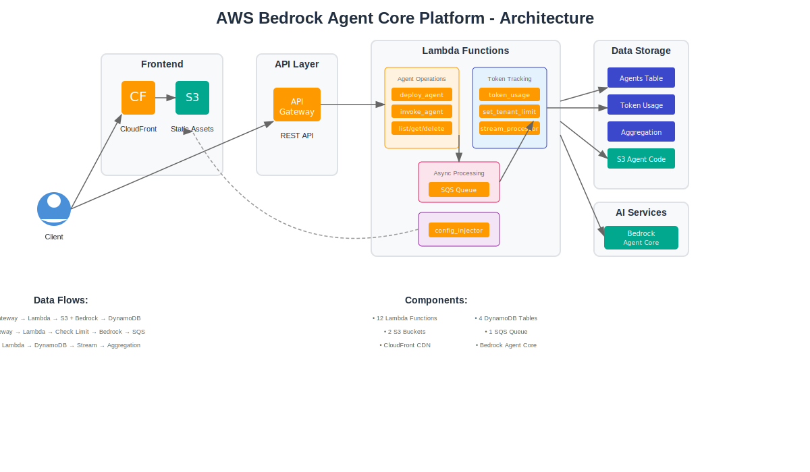

# AWS Bedrock Agent Core Full-Stack Web Application

A multi-tenant SaaS platform for deploying, managing, and invoking AI agents powered by AWS Bedrock Agent Core.

## Features

- **Deploy Custom AI Agents**: Configure agents with custom models (Claude Sonnet 4.5), system prompts, and modular tools
- **Modular Tool Composition**: Select from 6+ tools (web search, calculator, database query, email, web crawler, etc.)
- **Multi-Tenant Isolation**: Each agent tagged with tenant ID for cost tracking
- **Token Limits per Tenant**: Set and enforce token usage limits with automatic 429 responses when exceeded
- **Real-Time Token Usage Tracking**: Monitor costs per tenant with aggregated metrics and usage percentages
- **Agent Management**: List, invoke, update, and delete agents via REST API
- **Interactive Dashboard**: React-based UI with dark mode, charts, auto-refresh, and real-time updates

## Architecture



### Component Overview

| Component | Service | Purpose |
|-----------|---------|---------|
| Frontend | CloudFront + S3 | React dashboard with HeroUI v3 |
| API | API Gateway | REST API with 8 endpoints |
| Agent Ops | Lambda (5) | Deploy, invoke, list, get, delete agents |
| Token Tracking | Lambda (3) + SQS | Real-time usage aggregation |
| Storage | DynamoDB (4) | Agents, tokens, config, aggregates |
| AI | Bedrock Agent Core | Claude Sonnet 4.5 model |

### Data Flow

**Agent Deployment**:
```
Frontend → API Gateway → async_deploy → build_deploy → S3 + Bedrock → DynamoDB
```

**Agent Invocation with Token Limits**:
```
Frontend → API Gateway → invoke_agent → Check Limit → Bedrock → SQS → Aggregate
```

**Token Tracking Pipeline**:
```
SQS → sqs_to_dynamodb → DynamoDB → Stream → Aggregation → Dashboard
```

## Prerequisites

- AWS CLI configured with credentials
- Node.js 18+ and npm
- Python 3.10+
- AWS CDK CLI (`npm install -g aws-cdk`)
- CDK bootstrapped in your AWS account/region

## Deployment

### One-Command Deployment

```bash
./deploy.sh
```

This script will:
1. Install frontend dependencies
2. Build the React application
3. Deploy the entire CDK stack (infrastructure + frontend)
4. **Automatically generate config.js** with API endpoint and key
5. Deploy frontend to S3 and CloudFront
6. Invalidate CloudFront cache

### What Gets Deployed

- **API Gateway**: REST API with 7 endpoints
- **Lambda Functions**: 12 functions for agent operations
- **DynamoDB Tables**: 4 tables for agents, config, and token tracking
- **SQS Queue**: For asynchronous token usage processing
- **S3 Buckets**: For agent code and frontend hosting
- **CloudFront**: CDN for frontend distribution
- **IAM Roles**: With least-privilege permissions

### Automatic Configuration Injection

The deployment automatically:
- Retrieves the API Gateway endpoint URL
- Retrieves the API key value
- Generates `config.js` with these credentials
- Uploads it to S3
- Invalidates CloudFront cache

**No manual configuration needed!** The frontend is ready to use immediately after deployment.

## Stack Outputs

After deployment, you'll see outputs including:

- `FrontendUrl`: CloudFront URL for the dashboard
- `ApiEndpoint`: API Gateway endpoint
- `ApiKeyId`: API key ID (value is auto-injected into frontend)
- `CodeBucket`: S3 bucket for agent code
- `QueueUrl`: SQS queue for token tracking

## Usage

1. Visit the CloudFront URL from the stack outputs
2. Enter a tenant ID
3. Configure your agent (model, system prompt, tools)
4. Click "Deploy Agent"
5. Once deployed, invoke the agent from the dashboard
6. Monitor token usage and costs in real-time

## API Endpoints

- `POST /deploy` - Deploy new agent (requires API key)
- `POST /invoke` - Invoke deployed agent
- `GET /agents` - List all agents
- `GET /agent` - Get agent details
- `DELETE /agent` - Delete agent
- `GET /usage` - Get token usage statistics
- `PUT/GET /config` - Update/get agent configuration

## Development

### Local Frontend Development

```bash
cd frontend
npm install
npm run dev
```

The frontend will run on `http://localhost:3000` and use the deployed API.

### Redeploy After Changes

```bash
./deploy.sh
```

The config.js will be automatically regenerated with the latest API credentials.

## Cost Tracking

The platform automatically:
- Tracks token usage per agent invocation
- Aggregates costs by tenant ID
- Activates AWS cost allocation tags
- Displays usage in the dashboard with charts

## Cleanup

To delete all resources:

```bash
cdk destroy --app "python3 src/cdk_app.py"
```

## License

MIT
